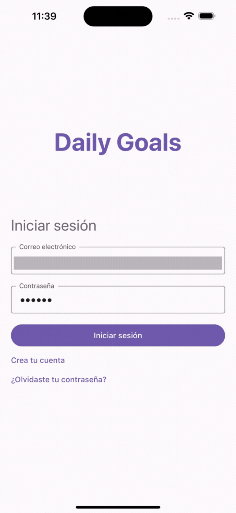

# Habit Tracker App

This is a habit tracking application built with React Native, Redux, and Redux Saga. It allows users to track their daily habits, set reminders, and visualize their progress over time.

## Features

- Email and password authentication
- List of your habits
- Create a new habit
- Mark a habit as done for the day
- Calendar with habit completion history

## Demo

